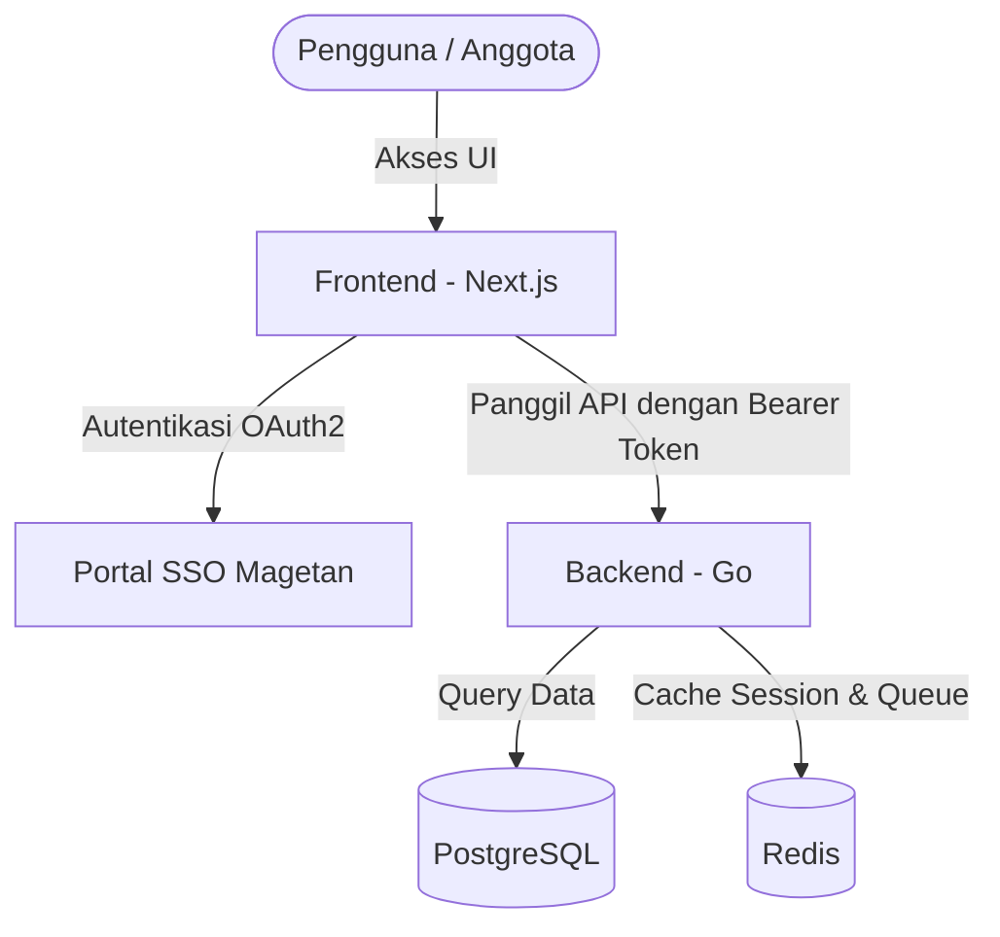

# Arsitektur & Spesifikasi Teknologi - DataAnggota (Ternormalisasi)

Dokumen ini menjelaskan rancangan arsitektur sistem dan detail **Spesifikasi Teknologi (Tech Stack)** untuk sistem **DataAnggota** database anggota Pelajar NU Magetan.

---

## 1. Ikhtisar Sistem (System Overview)

Sistem DataAnggota dirancang menggunakan arsitektur modular yang memisahkan Frontend dan Backend secara terpisah. Sistem ini terintegrasi penuh dengan portal SSO IPNU-IPPNU Magetan sebagai satu-satunya penyedia layanan autentikasi (Identity Provider).

---

## 2. Spesifikasi Teknologi Lengkap (Tech Stack)

Untuk menjaga konsistensi tampilan (UI/UX) dan performa agar sama persis dengan sistem portal SSO dan Laci, sistem DataAnggota dibangun menggunakan teknologi berikut:

### A. Backend (`DataAnggota/be`)
* **Bahasa Pemrograman**: Go (Golang)
* **Framework Web**: `github.com/labstack/echo/v4` (High performance, minimalist framework)
* **ORM (Object Relational Mapping)**: `gorm.io/gorm`
* **Driver Database**: `gorm.io/driver/postgres`
* **Driver Cache & Queue**: `github.com/redis/go-redis/v9`
* **Manajemen Environment**: `github.com/joho/godotenv`
* **Autentikasi & JWT**: `github.com/golang-jwt/jwt/v5`
* **Enkripsi Data (NIK)**: Library bawaan Go `crypto/aes` & `crypto/cipher` (AES-256 GCM)
* **Validasi Input**: `github.com/go-playground/validator/v10`

### B. Frontend (`DataAnggota/fe`)
* **Framework Utama**: Next.js (App Router) + React (TypeScript)
* **Library Autentikasi**: NextAuth.js v5 (`next-auth`) untuk integrasi SSO OAuth2
* **Styling & Tampilan**: Tailwind CSS (Vanilla CSS variable untuk mode gelap/terang)
* **UI Library**: Shadcn UI + Radix UI (konsisten dengan desain premium portal SSO & Laci)
* **Koleksi Ikon**: Lucide React
* **Manajemen Form**: React Hook Form
* **Validasi Skema Form**: Zod (digunakan untuk validasi NIK 16 digit, email, dan no HP)
* **Notifikasi Pop-up**: Sonner Toast
* **HTTP Client**: Native Fetch API dengan wrapper API kustom (`api.ts`) yang dilengkapi interceptor auto-logout jika status response `401 Unauthorized`

---

## 3. Struktur Folder & Desain Sistem

### A. Backend (`DataAnggota/be`)
Mengikuti pola **Clean Architecture**:
* `cmd/server/main.go`: Entry point utama aplikasi.
* `internal/config/`: Memuat variabel `.env`.
* `internal/database/`: Manajemen koneksi GORM Postgres dan Redis client.
* `internal/domain/`: Pendefinisian struct database model GORM (entitas data).
* `internal/repository/`: Layer akses data langsung untuk query PostgreSQL.
* `internal/service/`: Layer logika bisnis (validasi NIK, formatting phone, auto-assign organisasi IPNU/IPPNU).
* `internal/handler/`: Controller HTTP (routing Echo, handler request & response JSON).
* `internal/middleware/`: Middleware validasi access token JWT SSO.
* `internal/utils/`: Fungsi enkripsi AES, helper, dll.

### B. Frontend (`DataAnggota/fe`)
Mengikuti pola Next.js App Router standar:
* `src/app/`: Halaman dashboard, formulir pendaftaran anggota, dan callback OAuth.
* `src/auth.ts`: Konfigurasi NextAuth v5 untuk integrasi login SSO.
* `src/components/ui/`: Komponen UI reusable dari Shadcn.
* `src/lib/api.ts`: API client wrapper.
* `src/types/`: Definisi tipe data TypeScript.

---

## 4. Rancangan Skema Database Ternormalisasi (GORM Models)

### A. Tabel `admin_units`
Tabel kepengurusan unit pimpinan (PC, PAC, PR, atau PK) yang dibuat oleh admin.
- `id` (INT, PK) - Auto increment
- `role` (VARCHAR) - Cabang / PAC / Ranting / PK
- `nama_unit` (VARCHAR) - Contoh: "PAC Ngariboyo", "PR Balegondo", "PK MAN 1 Magetan"
- `kecamatan` (VARCHAR) - Lokasi wilayah kecamatan asal

### B. Tabel `admin_users`
Menghubungkan Akun SSO dengan unit kepengurusan yang dikelolanya.
- `id` (INT, PK) - Auto increment
- `sso_user_id` (UUID, Index) - ID User dari portal SSO
- `admin_unit_id` (INT, FK) - Relasi ke `admin_units.id`
- `role` (VARCHAR) - Level hak akses admin: Cabang / PAC / Ranting / PK

### C. Tabel `periods`
Menyimpan masa bakti kepengurusan masing-masing unit.
- `id` (INT, PK) - Auto increment
- `nama` (VARCHAR) - Contoh: "2025-2027", "2026-2027"
- `admin_unit_id` (INT, FK) - Relasi ke `admin_units.id`
- `is_active` (BOOLEAN) - Status masa bakti yang aktif berjalan saat ini

### D. Tabel `anggota`
Menyimpan profil dasar anggota. Kolom sensitif seperti NIK akan dienkripsi sebelum disimpan ke database.

| Kolom | Tipe Data | Keterangan |
| :--- | :--- | :--- |
| `id` | UUID (PK) | Auto-generated UUID |
| `sso_user_id` | UUID (Index) | Menghubungkan profil ke akun SSO |
| `foto_url` | VARCHAR(255) | Path file foto anggota |
| `nama_lengkap`| VARCHAR(255) | Nama lengkap anggota (Required) |
| `email` | VARCHAR(255) | Email unik (Required) |
| `nik` | VARCHAR(255) | NIK Terenkripsi (Required, 16 digit validasi) |
| `nia` | VARCHAR(50) | Nomor Induk Anggota (Unique) |
| `jenis_kelamin`| VARCHAR(10) | Jenis Kelamin: Laki-laki / Perempuan (Required) |
| `organisasi` | VARCHAR(10) | Otomatis terisi: IPNU (jika Laki-laki) / IPPNU (jika Perempuan) |
| `phone` | VARCHAR(20) | Nomor HP / WA aktif (Otomatis format internasional 62...) |
| `tempat_lahir`| VARCHAR(100) | Kota/Kabupaten kelahiran |
| `tanggal_lahir`| DATE | Tanggal lahir anggota |
| `alamat_lengkap`| TEXT | Alamat domisili saat ini |
| `pimpinan_unit_id`| INT | ID Relasi ke `admin_units.id` (Tempat Anggota Berafiliasi) |
| `periode_masuk_id`| INT | ID Relasi ke `periods.id` (Masa Bakti Saat Anggota Mendaftar) |
| `rfid` | VARCHAR(100) | Kode RFID Kartu Anggota Digital |
| `pekerjaan` | VARCHAR(100) | Pekerjaan anggota |
| `hobi_minat` | VARCHAR(255) | Hobi / minat bakat anggota |
| `is_verified`| BOOLEAN | Status verifikasi keaktifan anggota |
| `verified_by`| VARCHAR(100) | Nama admin yang melakukan verifikasi |
| `created_at` | TIMESTAMP | Waktu pembuatan data |
| `updated_at` | TIMESTAMP | Waktu pembaruan data |

### E. Tabel `riwayat_jabatans` (Kepengurusan Anggota)
Mencatat peran/jabatan anggota di tiap kepengurusan & periode tertentu.
- `id` (INT, PK) - Auto increment
- `anggota_id` (UUID, FK) - Relasi ke `anggota.id`
- `period_id` (INT, FK) - Relasi ke `periods.id`
- `admin_unit_id` (INT, FK) - Relasi ke `admin_units.id`
- `jabatan` (VARCHAR) - Contoh: Ketua, Sekretaris, Anggota
- `is_active` (BOOLEAN) - `true` jika saat ini masih aktif menjabat

### F. Tabel `riwayat_pendidikans` (Riwayat Pendidikan)
Menampung riwayat pendidikan anggota (One-to-Many dari `anggota`).
- `id` (INT, PK) - Auto increment
- `anggota_id` (UUID, FK) - Relasi ke `anggota.id` (On Delete Cascade)
- `jenjang` (VARCHAR) - SD, MI, SMP, MTs, SMA, SMK, MA, PT
- `nama_sekolah` (VARCHAR) - Nama institusi pendidikan

### G. Tabel `riwayat_perkaderans` (Riwayat Perkaderan)
Menampung riwayat perkaderan resmi yang pernah diikuti (One-to-Many dari `anggota`).
- `id` (INT, PK) - Auto increment
- `anggota_id` (UUID, FK) - Relasi ke `anggota.id` (On Delete Cascade)
- `nama` (VARCHAR) - Makesta, Lakmud, Lakut, Diklatama, Diklatmad, latin, latpel
- `tanggal` (DATE) - Tanggal pelaksanaan
- `tempat` (VARCHAR) - Lokasi/penyelenggara perkaderan

---

## 5. Keamanan Data & Validasi Bisnis
- **Enkripsi NIK**: Kolom `nik` dilindungi menggunakan enkripsi dua arah berbasis AES-GCM 256-bit menggunakan kunci rahasia (`ENCRYPTION_KEY`) yang disimpan di `.env`.
- **Validasi Format NIK**: NIK divalidasi ketat di frontend & backend agar tepat 16 digit.
- **Auto-Format Handphone**: Mengubah otomatis awalan `0` atau `+` menjadi `62` agar seragam saat disimpan.
- **Bearer Token Auth**: Semua komunikasi API dari frontend ke backend wajib membawa header `Authorization: Bearer <sso_access_token>`. Backend akan memvalidasi token tersebut ke server SSO sebelum memproses request.
